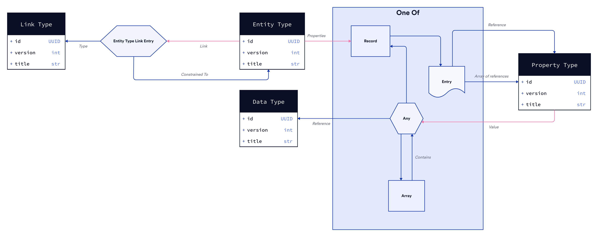

# The Block Protocol Type-System

[//]: # "TODO: Introduction"

## Overview

## Requirements

- [Rust](https://www.rust-lang.org/tools/install)
- [cargo-make](https://github.com/sagiegurari/cargo-make#installation)

## Building the Packages

- `cargo make build` - Compiles the Rust crate, and generates the following WASM-based NPM package
  - [@blockprotocol/type-system-web](../../packages/@blockprotocol/type-system)

For more granular task control look at `cargo make --list-all-steps`

## Running tests

- `cargo make test` - Runs the unit tests and headless WASM integration tests found in the [./src/tests](./src/tests) directory.
