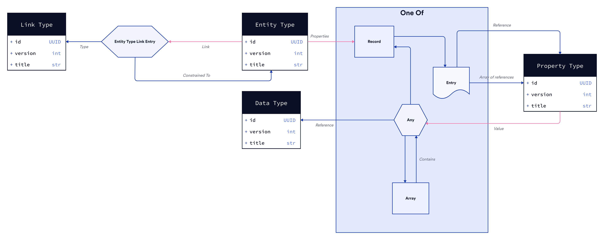

# The Block Protocol Type-System

[//]: # "TODO: Introduction"

## Overview

## Requirements

- [Rust](https://www.rust-lang.org/tools/install)

## Building the package

- `just build` - Compiles the Rust crate, and generates `@blockprotocol/type-system` npm package (located in parent folder)

For more granular task control run `just`

## Running tests

- `just test` - Runs the unit tests and headless WASM integration tests found in the [./src/tests](./src/tests) directory.
