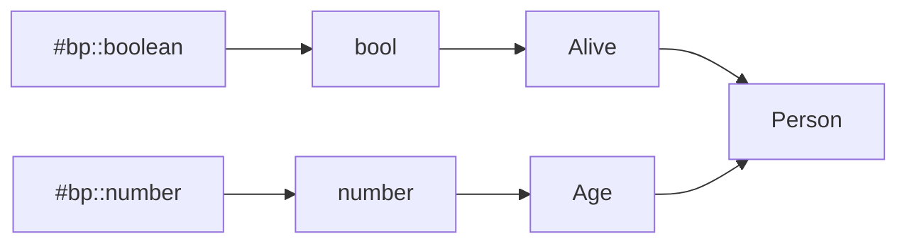
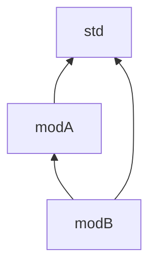
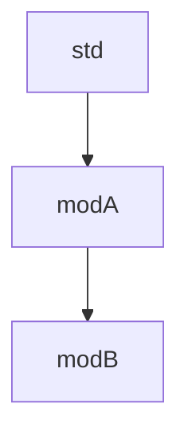

- Feature Name: type-system-dsl
- Start Date: 2022-08-24
- RFC
  PR: [blockprotocol/blockprotocol#532](https://github.com/blockprotocol/blockprotocol/pull/532)
- RFC
  Discussion: [blockprotocol/blockprotocol#540](https://github.com/blockprotocol/blockprotocol/discussions/540)

# Summary

[summary]: #summary

This RFC proposes a new system for expressing all types outlined in [RFC 0352],
and [RFC 0408] through a domain specific language (DSL). The DSL addresses pain points
that working with raw types using JSON brings with and includes a toolbox of programs to
aid in development, specifically geared towards developers.

TODO: name? file extension?

# Motivation

[motivation]: #motivation

Why are we doing this? What use cases does it support? What is the expected outcome?

# Guide-level explanation

[guide-level-explanation]: #guide-level-explanation

Explain the proposal as if it was already included in the protocol and you were teaching
it to another Block Protocol implementor. That generally means:

- Introducing new named concepts.
- Explaining the feature largely in terms of examples.
- Explaining how Block Protocol implementors and users should _think_ about the feature,
  and how it should impact the way they use the protocol. It should explain the impact as
  concretely as possible.
- If applicable, provide sample error messages, deprecation warnings, or migration
  guidance.
- If applicable, describe the differences between teaching this to existing and new Block
  Protocol users.

For implementation-oriented RFCs, this section should focus on how Block Protocol
implementors should think about the change, and give examples of its concrete impact. For
policy RFCs, this section should provide an example-driven introduction to the policy, and
explain its impact in concrete terms.

# Reference-level explanation

[reference-level-explanation]: #reference-level-explanation

## Domain-Specific-Language (DSL)

```abnf
IDENT = ALPHA *(ALPHA / DIGIT / "-")
```

### Primitive Types

```abnf
INTEGER = ["+" / "-"] 1*DIGIT
FLOAT = INTEGER "." 1*DIGIT
BOOLEAN = true / false;
STRING = ... ; TODO
COMMENT = "//" ; TODO
VALUE = FLOAT / INTEGER / STRING / BOOLEAN
```

### Comments

```abnf
COMMENT = "//" ; TODO
doc-comment = "///" ; TODO
```

There are two types of comments: code comments and documentation comments.
Code comments are erased during the compilation, while documentation comments are used
as the description of resources (if they support it).
Code comments are allowed anywhere, while documentation comments are only allowed before
resources.

### Attributes

```abnf
attribute = "#" "[" IDENT "=" (VALUE / (*(IDENT "::") IDENT)) "]"
```

Attributes are optional information about a specific resource (property-type, data-type,
link-type, entity-type, etc.), which are used to add more detail to a resource.

Attribute values may refer to previously set configuration values, depending on the
attribute these may be forbidden.

| Name      | Description                                                                            | Type          | Variable Support |
|-----------|----------------------------------------------------------------------------------------|---------------|------------------|
| `version` | Version of a resource, if not specified will be inserted on execution, defaults to `1` | `int`         | `false`          |
| `cfg`     | Conditionally emit code, depending if the expr evaluates to true                       | meta language | `false`          |

[//]: # (TODO: should we include cfg or remove?!)

### Reference

```abnf
range = [INTEGER] ".." [INTEGER]
reference-array = "[" variable [";" range] "]"
reference = variable / reference-array
```

```abnf
url = STRING
id = IDENT

use-key-value = id "=" VALUE
use-with = "with" "{" [*(use-key-value ",") use-key-value [","]] "}"
use = "use" url "as" id [use-with] ";"
```

-> How use works, required `self`

### Resources

Resources are types, which are declared in the DSL. They have $n$ inputs and one output.

The inputs to a resource are implicitly defined, and are the resources that have been used
in the current resource. The output of a resource is its identifier.

You can only reference types for which you have explicitly defined an id. Explicit
identifier for resources need to unique across their type and namespace.

There are four types of resources:

* `prop` (corresponding to property-types)
* `link` (corresponding to link-types)
* `data` (corresponding to data-types)
* `entity` (corresponding to entities)

#### Example 1

```
imp std;

prop age "Age" = number;

prop alive "Boolean" = bool;

entity person "Person" = {
  age?,
  alive
};
```



#### Example 2

```
entity person "Person" = {
  // ...
}

// This will fail
entity person "Person 2" = {
  // ...
}

// ----

entity "Human" = {
  // ...
}

// Implementation should warn (error in strict mode)
// but this would create two unique identifier on apply.
entity "Human" = {
  // ...
}


// ----

entity person "Person" = {
  // ... 
}

// This is ok, because the link person and entity person are completely different
// in namespace and type.
link person "Person";
```

#### Data Type

Currently unspecified

#### Property Type

```abnf
id = IDENT
title = STRING

prop-object = "{" [*(reference ",") reference [","]] "}"
prop-array = "[" prop-value [";" range] "]"
prop-value = variable / prop-object / prop-array / (prop-value "|" prop-value) / "(" prop-value ")"
prop = *doc-comment *attribute prop [id] title "=" prop-value ";"
```

#### Link Type

```abnf
id = IDENT
title = STRING

link = *doc-comment *attribute link [id] title ";"
```

#### Entity Type

```abnf
id = IDENT
title = STRING

entity-link-direction = "~>" / "->"
entity-link = link-direction reference 
entity-item = reference / entity-link-direction

entity-value = "{" [*(entity-item ",") (entity-item ",")] "}"
entity = *doc-comment *attribute entity [id] title "=" entity-value ";"
```

### Type Alias

```abnf
alias-prop = "alias" "prop" IDENT "=" prop-value ";"
alias-data = "alias" "data" IDENT ";" ; CURRENTLY UNDEFINED
alias-link = "alias" "link" IDENT ";" ; CURRENTLY UNDEFINED
alias-entity = "alias" "entity" IDENT ";" ; CURRENTLY UNDEFINED

alias = alias-prop / alias-entity / alias-data / alias-link;
```

Type aliases are convenient ways to split the resource declaration (the right-hand side of
the `=`) into multiple parts, which can be documented and reused.
They use the same type prefix as a non-alias resource would and can be used
interchangeably.
Every occurrence of their identifier will be replaced with the declared value at
compilation time.

### Variables

```abnf
type = "@" / "#" / ">" / "~"
module = IDENT
id = IDENT
version = INTEGER

variable = type? [module "::"] id ["/" version] 
```

Variables are used to reference to external and local resources, each type in the block
protocol has a specific prefix:

* `@` - property-type
* `#` - data-type
* `>` - link-type
* `~` - entity

The module refers to the use alias created for a repository of remote types, and can be
omitted, if omitted the module will default to `self`, which is the current repository.

The version is optional, and if not specified will default to the latest version, be
beware that this means that implementations may update every type when the mentioned type
was updated and the version wasn't pinned.

The type prefix is optional and is inferred to a concrete one depending on the context
used, this means `~> link` is equivalent to `~> >self::link`.

#### Inference Rules

* Link in entity: `~> link` inferred to `~> >self::link`
* Key of property: `prop "Prop" = { bp::a };` inferred to `prop "Prop" = { @bp::a };`
* Mention of reference in property: `prop "Prop" = [bp::number; ..5];` inferred
  to `prop "Prop" = [#bp::number; ..5];`
* Key of entity: `entity "Entity" = { a };` inferred to `entity "Entity" = { @self::a };`

#### Example 1

```
imp std;

prop age "Age" = #bp::number;
```

This means that the property `age` is of type `#bp::number` where `#` means it is a
data-type, `bp` is the synonym for `blockprotocol` in the `std` module, pointing to the
central repo, and `number` is a data-type that has been defined in that central repo.

### Functions

This is an unstable feature. Everywhere where a value is used, one can also use a function
call to builtin functions. The DSL is unable to specify new functions and the
implementation must provide all functions.

Functions must be pure, due to the very nature, functions are evaluated at compile time
and can only succeed or panic (crash), instead of returning an error. Functions are
strongly typed and support union types.

**DISCLAIMER:** This is highly unstable, unimplemented and may be removed at any point.

```abnf
arg = call / variable / VALUE;
call = IDENT "(" [*(arg ",") arg [","]] ")"
```

| Signature                 | Description                  | Panic                               |
|---------------------------|------------------------------|-------------------------------------|
| `toBool(any) -> bool`     | Convert a value to a boolean | Will never panic.                   |
| `toInt(any) -> int`       | Convert a value to an int    | Will panic if string is not integer |
| `toFloat(any) -> float`   | Convert a value to a float   | Will panic if string is not a float |
| `toString(any) -> string` | Convert a value to a string  | Will never panic                    |
| `ceil(float) -> float`    | Ceil a float                 | Will never panic                    |
| `floor(float) -> float`   | Floor a float                | Will never panic                    |

#### Conversion Table

| Input           | Function  | Result         |
|-----------------|-----------|----------------|
| `bool`          | `toBool`  | `bool`         |
| `""`            | `toBool`  | `false`        |
| `string`        | `toBool`  | `true`         |
| `0`             | `toBool`  | `false`        |
| `int`           | `toBool`  | `true`         |
| `float`         | `toInt`   | `floor(float)` |
| string of int   | `toInt`   | `int`          |
| `true`          | `toInt`   | `1`            |
| `false`         | `toInt`   | `0`            |
| `int`           | `toFloat` | `int.0`        |
| string of float | `toFloat` | `float`        |
| `true`          | `toFloat` | `1.0`          |
| `false`         | `toFloat` | `0.0`          |

### Modules

```abnf
path = *(IDENT "::") IDENT

import = "imp" path  ";"
```

Modules are files, which are either local or provided by the implemented (like `std`), the
path of a module is separated by `::`, if the path points to a directory, a file
named `mod.<INSERT SUFFIX HERE>` will be imported. An implementation **must** error if a
module couldn't be found.

Cycles of imports are not allowed, and there's no namespacing, identifiers for resources
need to be unique across all imported files.

Import resolution is done by analysing the imports of every file recursively, building a
tree of dependencies. These dependencies are then topologically sorted and concat together
to a single "virtual" file.

#### Example 1

##### Directory Structure

```
project
|  modA
|  |  modD.<INSERT SUFFIX HERE>
|  \- modE.<INSERT SUFFIX HERE>
|  modB
|   mod.<INSERT SUFFIX HERE>
\- modC.<INSERT SUFFIX HERE>
```

##### Code

```
imp modB; // This is valid
imp modA; // This will not compile as there's no `mod` file in the directory `modA`
imp modA::modD; // This is valid
imp modA::modE; // This is valid
```

#### Example 2

modA:

```
imp std;

// defines prop: A, B, C
```

modB:

```
imp std;
imp modA;

// defined prop: D, E, F
```

Module resolution graph:



Topologically sorted:



### Configuration

```abnf
id = IDENT

set *(id "::") id "=" VALUE ";"
```

Configuration is used to set values, which may be referenced later using interpolation or
during configuration of the implementations. Configuration keys need to be unique, cannot
be overwritten and user-defined configuration keys *may not* use built-in names.

Configuration keys are dictionaries, which are partitioned using `::`, this allows the
protection of certain values, to reduce breakage in future releases.

The namespace `impl` and `lang` are reserved and *may not* be used for user-defined
configuration.

`lang::unstable` and `impl::unstable` keys may be removed in any version but will only be
stabilized in major versions, before any feature is added, they are first added as an
unstable feature, and once matured will be stabilized.

| Name                     | Type                          | Description                                                                                                                                          | Effect                                                       | Default  | Implemented since     |
|--------------------------|-------------------------------|------------------------------------------------------------------------------------------------------------------------------------------------------|--------------------------------------------------------------|----------|-----------------------|
| `lang::transaction`      | `boolean`                     | Remote registry supports transactions                                                                                                                | If enabled, cycles which aren't self-referential are allowed | `false`  | not implemented       |
| `lang::unstable`         | `boolean`                     | Enable unstable feature in language, if available.                                                                                                   | Will set every key starting with `lang::unstable` to true.   | `false`  | `0.1`                 |
| `lang::unstable::env`    | `boolean`                     | Enable the usage of environmental variables for configuration values                                                                                 | Use of `${}` in configuration strings is possible.           | `false`  | not implemented       |
| `lang::unstable::format` | `boolean`                     | Enable string interpolation with configuration values                                                                                                | Use of `{}` in strings to reference configuration values.    | `false`  | not implemented       |
| `lang::unstable::func`   | `boolean`                     | Enable support for the calling of functions                                                                                                          | Enable the use of functions calls across the whole app       | `false`  | not implemented       |
| `impl::auth`             | `enum` (`"none", "password"`) | Remote registry has a specific authentication scheme, depending on the implementation, different methods for supplying the credentials are provided. | If enabled, will use authentication to contact registry      | `"none"` | `"none"`: since `0.1` |
| `impl::unstable`         | `boolean`                     | Enable unstable features in implementation, if available.                                                                                            | Will set every key starting with `impl::unstable` to true    | `false`  | `0.1`                 |

### `std` module

The std module is included in every implementation and should include the following code:

```
use "https://blockprotocol.org/types/@blockprotocol" as bp;

alias prop text = #bp::text;
alias prop number = #bp::number;
alias prop bool = #bp::boolean;
alias prop object = #bp::object;
```

The module provides sane defaults, like convenient aliases.

## Language Extensibility

### Reverse Links

Should reverse links be implemented in the graph type system they can be implemented in
this DSL by reversing the arrows from `->` to `<-` and `~>` to `<~`.

### Additional Item Information

Links and properties may have additional information attached to them in the future, this
DSL would provide support through the following extension:

```abnf
item-key-value = id "=" VALUE
item-block = "{" [*(item-key-value ",") item-key-value [","]] "}"
entity-item = entity-item-old [item-block]
```

#### Example 1

```abnf
prop "Title" {
  [a]? {prop1 = 2},
  b
}
```

### Data Types

The keyword `data` is reserved for custom `data` types in the future.

### Computed Props

The DSL could in theory support computed properties
through [Additional Item Information](#additional-item-information) and a specific
sub-language which is used to express the computation required.

### Sharing Entity Structures

The alias for entities, links and data are currently reserved and unused; one could
imagine an extension of the language, which makes use of a spread syntax to share common
properties for entities and property objects.

#### Example 1

```
alias entity human = {
  favorite-hobby/1,
  
  ~> friends?
};

entity "Child" = {
  age/1,
  ...human
};

entity "Adult" = {
  occupation/1,
  ...human
};
```

### Inheritance

Inheritance could be done through multiple ways: a new keyword: `extends` or implicitly
through the spread syntax.

#### Example 1

```
entity person "Person" = {
  age/1
};

// proposal (1): allow spread syntax on entities
entity "Child" = {
  ...person,
  grade/1
}

// proposal (2): use a new keyword `extends`
entity "Adult" extends person = {
  occupation/1
}
```

## Toolbox

### `plan`

### `apply`

### `bindings`

## Example

```
imp std;

use "https://blockprotocol.org/types/@alice" as self with {
    data = "{self}/data-type/{id}",
    prop = "{self}/property-type/{id}",
    link = "{self}/link-type/{id}",
    entity = "{self}/entity-type/{id}"
};

prop favorite-quote "Favorite Quote" = text/1;

prop user-id "User ID" = #bp::text/1 | #bp::number/1;

/// This is a further description of Contact Information
#[version = 14]
prop contact-information "Contact Information" = {
    @bp::email/1,
    @bp::phone-number/1?
};

/// This is some flavor text
#[version = 1]
prop interests "Interests" = {
    favorite-song/1?,
    favorite-film/1?,
    [hobby/1]?
};

prop contrived-property "Contrived Property" = #bp::number/1 | [#bp::number];

/// Have (something) as one's own; possess
link owns "Owns";

#[version = 1]
entity book "Book" = {
    name/1,
    published-on/1?,
    blurb/1,

    -> written-by/1,
    -> [friend-of/1],
    ~> best-friend@1?
};

alias prop some-object = {
  name/1,
  bp::email/1
}

alias prop property-value = text/1 | number/1 | [@some-object; ..5];

#[version = 1]
prop property-values "Property Values" = [@property-value; ..10];
```

# Drawbacks

[drawbacks]: #drawbacks

Why should we _not_ do this?

# Rationale and alternatives

[rationale-and-alternatives]: #rationale-and-alternatives

- Why is this design the best in the space of possible designs?
- What other designs have been considered and what is the rationale for not choosing them?
- What is the impact of not doing this?

# Prior art

[prior-art]: #prior-art

## Hashicorp Configuration Language (HCL)

The [Hashicorp Configuration Language](https://github.com/hashicorp/hcl) is a language
used at HashiCorp in their popular tools like [terraform](https:://terraform.io), it
provides a simpler and easier interface for configuration.
The community of HashiCorp has seen great success in the proliferation of the language and
is now used in all major products. It was inspired
by [libucl](https://github.com/vstakhov/libucl)
and [nginx](http://nginx.org/en/docs/beginners_guide.html#conf_structure).

HCL was one of the major initial inspirations for this RFC.

## Rust

This proposal, especially the syntax of arrays, has been inspired
by [Rust](https://www.rust-lang.org/) a programming language, which has seen wide
adoption.

## Typescript

[Typescript](https://www.typescriptlang.org/), a static type system, built on top of
Javascript is used worldwide and has seen wide adoption. It was the inspiration for union
types.

One of the problems associated with typescript, is that it is very complex with e.g.
conditional types and can be considered turing-complete. The proposed DSL tries to
specifically avoid these pitfalls in the type system.

## JSON

JSON is a data-transfer protocol and the RFC for graph type systems and versioning use it
to express types. The main pain point with JSON is that it is very verbose and hard
to write, read and validate for a human, with a lot of redundant information.

To ease with all the associated problems, this DSL is getting proposed created to ease the
development and modification of types.

## Nix Language

[Nix](https://nixos.org/) is an ecosystem to create reproducible builds and deployments,
which has a custom DSL,
the [Nix Language](https://nixos.wiki/wiki/Overview_of_the_Nix_Language), which is a
functional configuration language.
This has sparked controversy, and some accredited the DSL as part as to why nix hasn't
found widespread adoption yet, due to the fact that often a functional programming
language isn't very suitable as a configuration language.
This proposal learns from that "mistake" and tries to instead take a more traditional
approach through the use of declarative paradigms instead.

# Unresolved questions

[unresolved-questions]: #unresolved-questions

- What parts of the design do you expect to resolve through the RFC process before this
  gets merged?
- What parts of the design do you expect to resolve through the implementation of this
  feature before stabilization?
- What related issues do you consider out of scope for this RFC that could be addressed in
  the future independently of the solution that comes out of this RFC?

# Future possibilities

[future-possibilities]: #future-possibilities

Think about what the natural extension and evolution of your proposal would be and how it
would affect the project and ecosystem as a whole in a holistic way. Try to use this
section as a tool to more fully consider all possible interactions with the project and
ecosystem in your proposal. Also consider how this all fits into the roadmap for the
project and of the relevant sub-team.

This is also a good place to "dump ideas", if they are out of scope for the RFC you are
writing but otherwise related.

If you have tried and cannot think of any future possibilities, you may simply state that
you cannot think of anything.

Note that having something written down in the future-possibilities section is not a
reason to accept the current or a future RFC; such notes should be in the section on
motivation or rationale in this or subsequent RFCs. The section merely provides additional
information.
